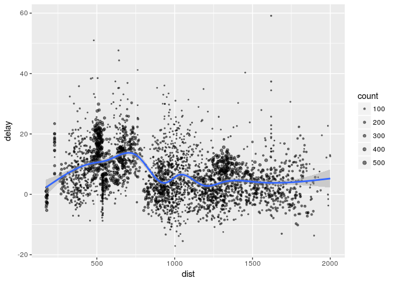

Sparklyr Introduction
================

In this notebook we walk through some basic examples of how to use sparklyr in R. This notebook is based on the guide provided at <http://spark.rstudio.com/>.

Local Mode
----------

We are interested in using Spark to perform distributed computations in R, so what benefit is there in running it in local mode? In most cases we use local mode for debugging code without the need to be connected to a Spark cluster. For us it is used for running a basic demonstration of Spark in R using **sparklyr**.

Connecting to Spark
-------------------

First we load **sparklyr** and install Spark if it is not already installed:

``` r
library(sparklyr)
spark_install(version = "2.3.1")
```

We can connect to clusters and local instances of Spark as follows (In RStudio make sure to create a new Spark connection):

``` r
sc <- spark_connect(master = "local")
```

    ## * Using Spark: 2.3.1

The above snippet creates a new SparkContext with the master node set as the local machine. More details about how Spark carries out computations on a cluster is given [here](http://spark.apache.org/docs/latest/cluster-overview.html). The status of the SparkContext can be monitored in a web view, accessed by clicking SparkUI in the Connections tab of RStudio. An overview of SparUI is given [here](https://jaceklaskowski.gitbooks.io/mastering-apache-spark/content/spark-webui.html).

Using dplyr
-----------

Next we will show that we can use all of the standard dplyr verbs against tables in the cluster. First we must populate the cluster with data:

``` r
library(dplyr)
```

    ## 
    ## Attaching package: 'dplyr'

    ## The following objects are masked from 'package:stats':
    ## 
    ##     filter, lag

    ## The following objects are masked from 'package:base':
    ## 
    ##     intersect, setdiff, setequal, union

``` r
iris_tbl <- copy_to(sc, iris)
flights_tbl <- copy_to(sc, nycflights13::flights, "flights")
batting_tbl <- copy_to(sc, Lahman::Batting, "batting")
src_tbls(sc)
```

    ## [1] "batting" "flights" "iris"

Visiting the SparkUI we see that this is a relatively small database (only about 50MB). We could imagine in real cases we would be working with larger databases. Note that the data tables lie `iris_tbl` are lists and are not stored in memory.

Now let's try a simple filtering example:

``` r
# filter by departure delay and print the first few records
flights_tbl %>% filter(dep_delay == 2) %>% head()
```

    ## # Source:   lazy query [?? x 19]
    ## # Database: spark_connection
    ##    year month   day dep_time sched_dep_time dep_delay arr_time
    ##   <int> <int> <int>    <int>          <int>     <dbl>    <int>
    ## 1  2013     1     1      517            515      2.00      830
    ## 2  2013     1     1      542            540      2.00      923
    ## 3  2013     1     1      702            700      2.00     1058
    ## 4  2013     1     1      715            713      2.00      911
    ## 5  2013     1     1      752            750      2.00     1025
    ## 6  2013     1     1      917            915      2.00     1206
    ## # ... with 12 more variables: sched_arr_time <int>, arr_delay <dbl>,
    ## #   carrier <chr>, flight <int>, tailnum <chr>, origin <chr>, dest <chr>,
    ## #   air_time <dbl>, distance <dbl>, hour <dbl>, minute <dbl>,
    ## #   time_hour <dttm>

Let's quickly review some dplyr grammar: The pipe operator `%>%` indicates feeding the expression on its left-hand side into the function on the right-hand side. This allows us to chain many functions on a dataframe while maintaining readability of the command (compare the above with the equivalent expression `head(filter(flights_tbl, dep_delay==2))`).

A more coplicated example:

``` r
delay <- flights_tbl %>% 
  group_by(tailnum) %>%
  summarise(count = n(), dist = mean(distance), delay = mean(arr_delay)) %>%
  filter(count > 20, dist < 2000, !is.na(delay)) %>%
  collect
```

    ## Warning: Missing values are always removed in SQL.
    ## Use `AVG(x, na.rm = TRUE)` to silence this warning

    ## Warning: Missing values are always removed in SQL.
    ## Use `AVG(x, na.rm = TRUE)` to silence this warning

Plot the queried data:

``` r
library(ggplot2)
ggplot(delay, aes(dist, delay)) +
  geom_point(aes(size = count), alpha = 1/2) +
  geom_smooth() +
  scale_size_area(max_size = 2)
```

    ## `geom_smooth()` using method = 'gam'

 Now we review ggplot2 syntax: The first line specifies the x-y axes of the plot. Each additional line preceded by a '+' indicates another layer to be added. The first layer added is a scatter plot where the point size is determined by the counts of instances. The second layer is a smoothed conditional mean with standard errors. The conditional mean is modeled by a generalized additive model (GAM) and the confidence intervals are determined by asymptotics (I assume; verify this). We will not take the smoothing function too seriously, it is simply here to roughly illustrate the conditional mean.

Using SQL
---------

We can similarly use SQL statements to query data in the cluster. The `spark_connection` object `sc` implements a **DBI** interface for Spark so we use `dbGetQuery()`:

``` r
library("DBI")
iris_preview <- dbGetQuery(sc, "SELECT * FROM iris LIMIT 10")
iris_preview
```

    ##    Sepal_Length Sepal_Width Petal_Length Petal_Width Species
    ## 1           5.1         3.5          1.4         0.2  setosa
    ## 2           4.9         3.0          1.4         0.2  setosa
    ## 3           4.7         3.2          1.3         0.2  setosa
    ## 4           4.6         3.1          1.5         0.2  setosa
    ## 5           5.0         3.6          1.4         0.2  setosa
    ## 6           5.4         3.9          1.7         0.4  setosa
    ## 7           4.6         3.4          1.4         0.3  setosa
    ## 8           5.0         3.4          1.5         0.2  setosa
    ## 9           4.4         2.9          1.4         0.2  setosa
    ## 10          4.9         3.1          1.5         0.1  setosa

Machine Learning
----------------

Sparklyr comes prepackaged with the machine learning algorithms from **spark.ml** that can be used on the `spark_connection` object. Here we will demonstrate a simple linear regression model `ml_linear_regression` on the *mtcars* dataset to model fuel consumption as a function of a vehicle's weight and cylinders. First we copy the dataset into Spark:

``` r
mtcars_tbl = copy_to(sc, mtcars)
```

We perform some pre-processing and partition the data into equally-sized training and test set using **dplyr** verbs (Note that this operation creates datasets in memory!):

``` r
partitions <- mtcars_tbl %>%
  filter(hp >= 100) %>%
  mutate(cyl8 = cyl == 8) %>%
  sdf_partition(training = 0.5, test = 0.5, seed = 1099)
```

Next we fit the model. Note that the **dplyr** pipe syntax can be used.

``` r
fit <- partitions$training %>%
  ml_linear_regression(response = "mpg", features = c("wt", "cyl"))
print(fit)
```

    ## Formula: mpg ~ wt + cyl
    ## 
    ## Coefficients:
    ## (Intercept)          wt         cyl 
    ##   33.499452   -2.818463   -0.923187

The `summary()` function provides an `lm()`-like summary output:

``` r
summary(fit)
```

    ## Deviance Residuals:
    ##    Min     1Q Median     3Q    Max 
    ## -1.752 -1.134 -0.499  1.296  2.282 
    ## 
    ## Coefficients:
    ## (Intercept)          wt         cyl 
    ##   33.499452   -2.818463   -0.923187 
    ## 
    ## R-Squared: 0.8274
    ## Root Mean Squared Error: 1.422

Reading and Writing Data
------------------------

We can write data into the local filesystem or the Spark cluster from various file formats. To demonstrate we will create a CSV, JSON, and Parquet file from the example datasets and write them back into the database. First create tempfiles:

``` r
temp_csv <- tempfile(fileext = ".csv")
temp_parquet <- tempfile(fileext = ".parquet")
temp_json <- tempfile(fileext = ".json")
```

Then we write them into Spark with the appropriate functions:

``` r
spark_write_csv(iris_tbl, temp_csv)
iris_csv_tbl <- spark_read_csv(sc, "iris_csv", temp_csv)

spark_write_parquet(iris_tbl, temp_parquet)
iris_parquet_tbl <- spark_read_parquet(sc, "iris_parquet", temp_parquet)

spark_write_json(iris_tbl, temp_json)
iris_json_tbl <- spark_read_json(sc, "iris_json", temp_json)
```

In each case the data file is read into a Spark DataFrame, the native data object used in Spark. Verify that the data has been written to Spark:

``` r
src_tbls(sc) # A dplyr function that lists all tables held in a data source
```

    ## [1] "batting"      "flights"      "iris"         "iris_csv"    
    ## [5] "iris_json"    "iris_parquet" "mtcars"
